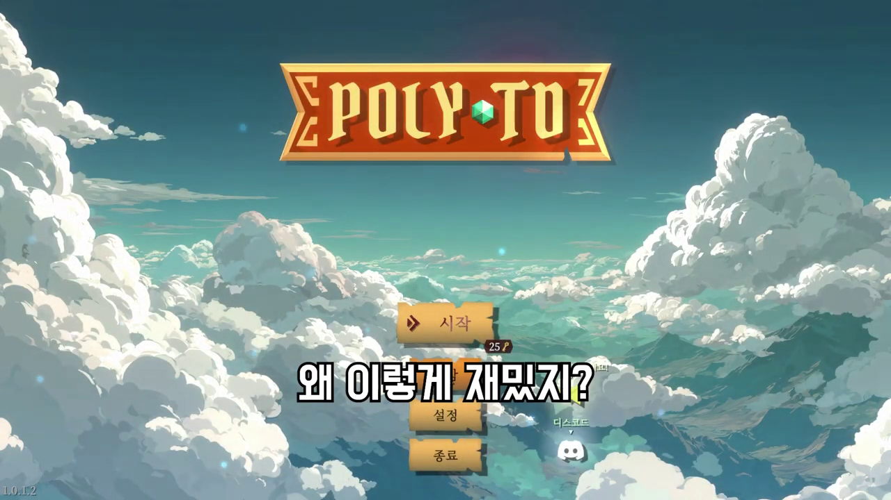
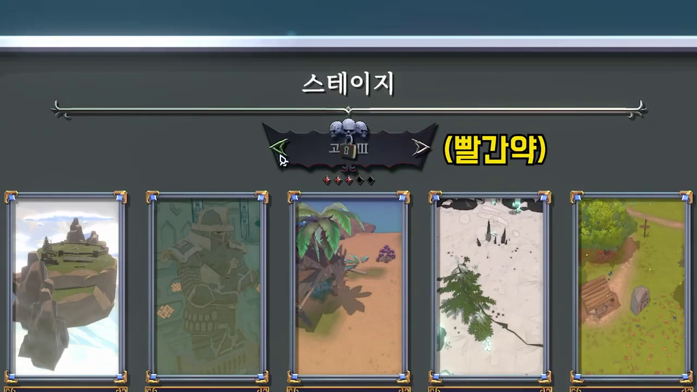
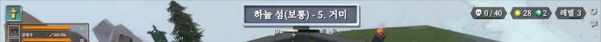
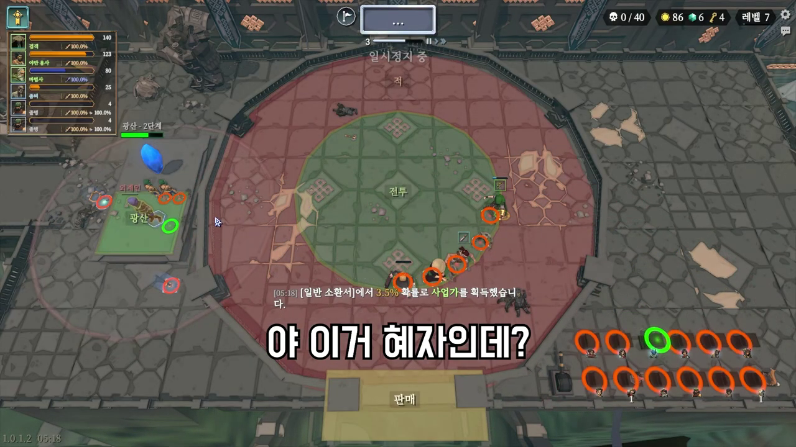
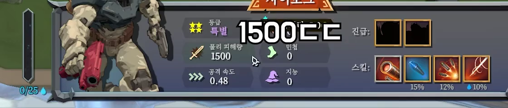
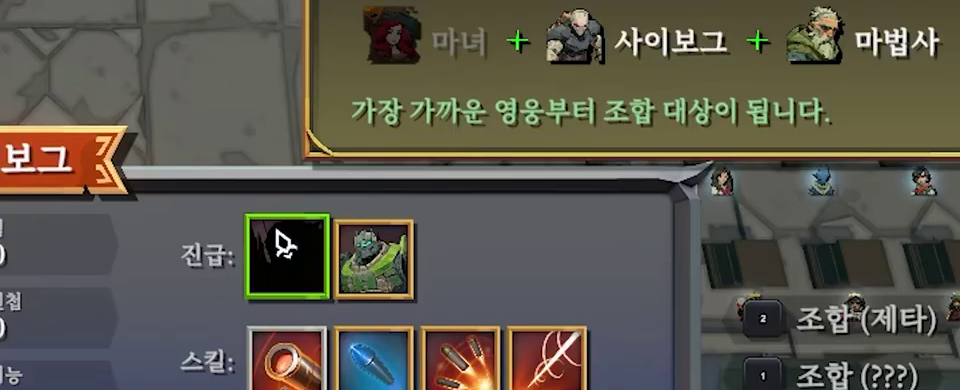

# Poly TD 영상 기반 게임 흐름 및 UI 분석

분석 대상 영상: [7시간 순삭 당한 '영웅 조합' 타워 디펜스ㅣ폴리 타워 디펜스 (Poly TD)](https://www.youtube.com/watch?v=rfLrXQEAi2o)

보조 참고 자료: [Steam - Poly TD / 폴리 타워 디펜스](https://store.steampowered.com/app/2871390/Poly_TD/?l=koreana)

분석일: 2026-06-13

## 분석 범위

- 영상 길이: 8분 2초
- 영상 업로드일: 2026-02-07
- 게임명: Poly TD / 폴리 타워 디펜스
- 장르: 타워 디펜스, 로그라이크, 전략
- 주의: 영상 중앙에 크게 표시되는 흰색 한글 문구는 대부분 유튜버 편집 자막이다. 실제 게임 UI로 보이는 요소만 별도로 구분했다.

## 핵심 요약

Poly TD는 워크래프트 유즈맵식 랜덤 디펜스의 흐름을 싱글 플레이 로그라이크 구조로 옮긴 게임이다. 플레이어는 전투 중 유닛을 무작위로 뽑고, 같은 유닛 3개 또는 지정 레시피를 조합해 상위 영웅으로 올린다. 원본 참고 영상에서는 보스 처치와 미션 달성 후 다음 스테이지로 넘어가는 흐름이 보이지만, 이 프로젝트의 확정 진행 모델은 다르다. 새 게임 시작 때 맵을 하나 고르고 1~40R 최종 보스까지 같은 맵을 진행하며, 클리어 보상은 다음 새 게임의 맵 선택권이다.

UI는 중앙 전투 공간을 크게 비워두고, 핵심 정보와 조작은 화면 가장자리에 압축 배치한다. 상단은 스테이지/웨이브/재화, 좌측은 보유 유닛 또는 상태 목록, 하단은 선택 유닛 상세, 우측 하단은 조합/판매/대기 유닛 관리가 담당한다.

## 게임 흐름

### 1. 메인 메뉴



- 하늘과 구름 배경 위에 `POLY TD` 로고가 크게 배치된다.
- 중앙에 `시작`, `설정`, `종료` 버튼이 세로로 놓인다.
- 메뉴 화면은 설명형 랜딩 페이지가 아니라 바로 게임을 시작하는 런처에 가깝다.
- 하단에는 커뮤니티 또는 외부 링크로 보이는 아이콘이 작게 배치된다.

### 2. 스테이지 선택



- `스테이지` 제목 아래에 카드형 맵 목록이 가로로 배치된다.
- 카드에는 맵 이미지, 맵 이름, 난이도/최고 점수로 보이는 정보가 붙는다.
- 확인된 맵 카드:
  - 하늘 섬
  - 지하 던전
  - 신비한 해변
  - 눈 덮인 숲
  - 끝없는 갈림길
- 일부 카드는 어둡게 처리되어 잠금 상태임을 보여준다.
- 상단 중앙에는 난이도 선택 배지가 있으며 좌우 화살표로 난이도를 바꾸는 구조다.
- 영상에서 `고대 III` 같은 난이도 표기와 붉은/검은 보석형 진행 표시가 확인된다.

### 3. 스테이지 진입

- 스테이지가 시작되면 중앙에 원형 또는 고리형 전투 경로가 표시된다.
- 적은 경로를 따라 이동하고, 플레이어 유닛은 경로 주변 또는 중앙 전투 구역에서 공격한다.
- 좌측에는 소환/대기 공간처럼 보이는 별도 플랫폼과 크리스탈 오브젝트가 있다.
- 스테이지명은 상단 중앙에 표시된다. 예: `하늘 섬(보통) - 5. 거미`
- 상단 우측에는 처치/목표 카운터, 골드, 보석, 열쇠 또는 특수 재화, 레벨이 한 줄로 표시된다.
- 전투 중에도 조합, 판매, 유닛 선택, 미션 확인이 가능한 실시간 관리형 구조다.

### 4. 전투와 웨이브 진행

- 웨이브 카운터가 상단 중앙/우측에 계속 노출된다.
- 적은 원형 경로를 따라 몰려오며, 유닛들은 자동 공격한다.
- 플레이어의 주요 판단은 유닛 배치보다 다음에 어떤 유닛을 뽑고 무엇을 조합할지에 집중된다.
- 보스 처치 시 보상 로그가 화면 중앙 하단에 표시된다.
- 미션 달성도 같은 위치에 로그로 표시된다. 예: `[15:02] 임무 [성숙한 조합가] 달성 (100 골드, 5 보석)`

### 5. 유닛 뽑기와 대기열 관리

- 전투 중 일반 소환을 통해 낮은 등급 유닛을 계속 확보한다.
- 영상에서 농부, 강아지 같은 기본 유닛이 조합 재료로 쓰이는 장면이 확인된다.
- 보유 유닛은 화면 우측 또는 우측 하단에 작은 초상/아이콘으로 모여 표시된다.
- 같은 유닛은 작은 숫자 카운트로 수량이 표시된다.
- 선택된 유닛은 하단 상세 패널에 크게 표시되고, 조합 가능 여부에 따라 우측 액션 버튼이 바뀐다.

### 6. 조합 시스템

조합은 최소 두 종류로 보인다.

- 3개 조합: 같은 유닛 3개를 상위 유닛으로 합친다.
- 레시피 조합: 서로 다른 특정 유닛 조합으로 고급 영웅을 만든다.

확인된 레시피 예시:

- 농부 + 농부 + 농부 -> 모험가
- 강아지 + 강아지 + 강아지 -> 부족민
- 마녀 + 사이보그 + 마법사 -> ??? 레시피
- 잔다르크 + 스사노오 -> ??? 레시피

레시피 UI는 갈색 패널에 재료 아이콘과 `+` 기호를 크게 보여준다. 하단에는 `가장 가까운 영웅부터 조합 대상이 됩니다.`라는 안내가 표시된다. 이는 버튼을 누를 때 현재 선택 유닛 또는 가까운 유닛 기준으로 조합 재료를 자동 선택하는 방식으로 해석된다.

### 7. 유닛 성장과 전투력 표현

선택 유닛 상세 패널에서 확인되는 정보:

- 유닛 초상 또는 3D 모델
- 이름
- 등급
- 물리 피해량
- 공격 속도
- 민첩
- 지능
- 진급 슬롯
- 스킬 아이콘
- 스킬별 확률 또는 쿨다운처럼 보이는 수치

예시로 `사이보그`는 `특별` 등급, 물리 피해량 1500, 공격 속도 0.48로 표시된다. 고등급 유닛은 여러 개의 스킬 아이콘을 가지고, 스킬마다 `15%`, `12%`, `10%` 같은 발동 확률로 보이는 값이 붙는다.

### 8. 스테이지 클리어와 다음 단계

- 스테이지 클리어 후 검은 로딩 화면에 `불러오는 중...`이 표시된다.
- 이후 다시 스테이지 선택 화면으로 돌아가거나 다음 맵으로 진행하는 원본 흐름이 보인다. 이 프로젝트에서는 같은 판 안에서 다음 맵으로 자동 진행하지 않는다.
- 영상 후반에는 여러 스테이지를 연속으로 진행하는 로그라이크 런 구조가 보인다.

## UI 구조 분석

### 메인 화면 레이아웃

인게임 화면은 다음과 같은 구조다.

```text
┌──────────────────────────────────────────────────────────────┐
│ 좌측 상태 목록        상단 스테이지/웨이브/재화/레벨          │
│                                                              │
│             중앙 전투 필드 / 적 경로 / 공격 범위             │
│                                                              │
│ 좌측 소환/기지     하단 선택 유닛 패널      우측 조합/판매    │
└──────────────────────────────────────────────────────────────┘
```

### 상단 HUD



- 중앙: 현재 스테이지명, 난이도, 웨이브명
- 우측: 목표 카운터, 골드, 보석, 특수 재화, 레벨
- 우측 끝: 설정 아이콘, 메시지 또는 도움말 아이콘
- 일부 구간에는 일시정지/배속 조작으로 보이는 버튼이 상단 중앙에 표시된다.

장점:

- 전투 필드를 가리지 않는다.
- 플레이 중 자주 확인해야 하는 값을 한 줄에 모은다.

주의점:

- 아이콘만으로 재화 종류를 구분해야 하므로 초반 학습이 필요하다.
- 작은 숫자가 많아 저해상도나 작은 창에서는 가독성이 떨어질 수 있다.

### 좌측 패널

- 보유 유닛 또는 활성 유닛 목록이 세로로 표시된다.
- 각 줄은 초상, 이름, 막대 게이지, 수치, 퍼센트 정보를 포함한다.
- 스테이지 내부의 기지/소환 지점 이름도 좌측 근처에 표시된다. 예: `광산 - 2단계`

역할:

- 현재 런의 전력 상태 요약
- 유닛별 상태/기여도 확인
- 기지 또는 보상 오브젝트 상태 확인

### 중앙 전투 필드



- 원형 또는 타원형 경로가 핵심 시각 요소다.
- 유닛 공격 범위는 노란 원으로 표시된다.
- 편집/배치 상태에서는 녹색 허용 구역과 붉은 제한 구역이 오버레이로 표시된다.
- 전투 중에는 적 이동, 투사체, 스킬 이펙트가 중앙에 집중된다.

특징:

- 플레이어 조작 UI보다 전투 관전성을 우선한다.
- 후반에는 유닛과 적, 스킬 이펙트가 많아져 혼잡도가 커진다.

### 하단 선택 유닛 패널



- 선택한 유닛의 가장 중요한 정보가 하단 전체 폭에 가깝게 표시된다.
- 좌측에는 유닛 초상/모델과 세로 게이지가 있다.
- 중앙에는 이름, 등급, 스탯이 있다.
- 우측에는 진급 슬롯과 스킬 아이콘이 있다.
- 스킬 아이콘 아래에는 발동률 또는 강화 수치가 붙는다.

이 패널은 게임의 핵심 조작 허브다. 유닛을 선택하면 이곳에서 성장 가능성, 조합 가능성, 스킬 구성을 즉시 판단할 수 있어야 한다.

### 우측 액션 영역

- `조합`, `판매` 버튼이 세로로 표시된다.
- 버튼에는 단축키 숫자가 함께 붙는다. 예: `1 조합`, `0 판매`
- 조합 조건을 만족하면 버튼 라벨이 구체적인 조합명으로 바뀐다. 예: `조합(모험가)`, `조합(부족민)`, `조합(제타)`
- 판매 가격은 버튼 옆에 골드 아이콘과 함께 표시된다.

### 레시피 팝업



- 조합 가능한 레시피가 생기면 화면 중앙 또는 하단에 큰 갈색 안내 팝업이 뜬다.
- 재료는 초상 아이콘 + 이름으로 나열된다.
- 새 레시피 발견 시 `새로운 레시피` 문구가 강조된다.
- 조합 대상 선택 규칙을 짧은 녹색 문구로 알려준다.

좋은 점:

- 복잡한 조합식을 외우지 않아도 즉시 확인할 수 있다.
- 재료 부족 여부를 초상 음영 처리로 표현한다.

개선 여지:

- 팝업이 전투 화면을 일부 가리므로, 후반 고밀도 전투에서는 자동 접기 또는 작은 알림 전환이 필요할 수 있다.

### 대기 유닛/인벤토리 표시

- 우측 하단 또는 맵 가장자리에 작은 유닛 초상들이 나열된다.
- 동일 유닛 보유 수량은 숫자로 표시된다.
- 특정 상태에서는 유닛이 원형 테두리로 강조된다.
- 주황색 원형 슬롯이 다수 보이는데, 대기 유닛 또는 배치 후보를 시각화하는 영역으로 보인다.

### 판매/정리 UI

- 배치/정리 상태에서 하단 중앙에 `판매` 영역이 크게 표시된다.
- 유닛을 해당 영역으로 보내 판매하거나 정리하는 구조로 보인다.
- 판매 버튼과 별도의 드래그 앤 드롭식 정리 UX가 공존할 가능성이 있다.

## 화면별 관찰 메모

| 시간 | 관찰 내용 |
| --- | --- |
| 00:20 | 농부 3개 조합으로 `모험가` 레시피가 표시된다. 선택 유닛 하단 패널과 조합/판매 버튼이 함께 보인다. |
| 00:40 | `하늘 섬(보통) - 5. 거미` 스테이지. 상단 HUD, 좌측 상태 목록, 중앙 원형 경로, 우측 목표 지점이 확인된다. |
| 01:00 | 강아지 3개 조합으로 `부족민` 레시피가 표시된다. |
| 01:40 | `사이보그` 선택 상태. 등급, 피해량, 공격 속도, 스킬 아이콘, 진급 슬롯이 하단 패널에 노출된다. |
| 02:20 | 보스 처치 보상과 미션 달성 로그가 표시된다. 선택 오브젝트에는 `열기` 버튼이 나타난다. |
| 03:00 | 후반 웨이브에서 유닛 수와 스킬 이펙트가 늘어나며 화면 밀도가 높아진다. |
| 04:00 | `지하 던전(어려움)` 계열 스테이지. 녹색/붉은 범위 오버레이와 판매 영역이 표시되어 정리/배치 모드가 있음을 보여준다. |
| 04:20 | 새 레시피 팝업. `마녀 + 사이보그 + 마법사` 조합식과 조합 버튼이 확인된다. |
| 05:00 | `잔 다르크 + 스사노오` 조합식이 표시된다. |
| 05:20 | `나폴레옹` 같은 고급 영웅이 등장하며 스킬 아이콘 수가 늘어난다. |
| 06:00 | 보스 또는 강적 전투. 다수 유닛과 투사체가 한 화면에 겹쳐 표시된다. |
| 06:40 | 스테이지 선택 화면. 카드형 맵 목록, 난이도 선택, 잠금 상태가 보인다. |
| 07:20 | 메인 메뉴. 로고, 시작/설정/종료 버튼, 구름 배경이 확인된다. |

## 현재 프로젝트에 참고할 만한 설계 포인트

### 우선순위가 높은 요소

- 중앙 전투 필드는 가능한 한 비워두고 UI는 가장자리로 보낸다.
- 선택 유닛 패널은 하단에 크게 고정한다.
- 조합 가능 레시피는 팝업으로 즉시 알려준다.
- 조합 버튼은 단순 `조합`보다 `조합(결과명)`처럼 결과를 보여주는 편이 좋다.
- 유닛 수량은 작은 초상 + 숫자 카운트로 압축한다.
- 스테이지 선택은 카드형 맵 목록과 난이도 선택을 분리한다.

### 구현 시 주의할 점

- 조합식이 많아질수록 레시피 UI가 게임 흐름을 방해할 수 있다. 발견 알림, 조합 도감, 현재 가능 조합 목록을 분리하는 것이 좋다.
- 후반 이펙트가 많아질수록 전투 판독성이 떨어진다. 이펙트 투명도, 피해 숫자 표시 옵션, 중요 적 강조가 필요하다.
- 재화 아이콘이 많으면 신규 플레이어가 의미를 외우기 어렵다. 툴팁 또는 첫 획득 안내가 필요하다.
- 판매/조합/진급이 모두 선택 유닛 기준으로 실행되므로, 잘못 선택한 유닛을 소모하지 않도록 확인 상태와 하이라이트가 중요하다.
- 편집/배치 모드에서는 전투 모드와 확실히 다른 색상 오버레이가 필요하다.

## 정리

Poly TD의 플레이 감각은 `랜덤 소환 -> 같은 유닛 3개 조합 -> 레시피 조합 -> 고급 영웅 확보 -> 웨이브/보스 돌파 -> 다음 스테이지 선택`으로 압축된다. 현재 프로젝트에 적용할 때는 마지막 단계를 같은 판 안의 자동 맵 전환이 아니라 `40R 최종 보스 클리어 -> 다음 새 게임의 맵 선택권 해금`으로 해석한다. UI는 이 루프를 빠르게 반복하도록 설계되어 있으며, 특히 하단 유닛 상세 패널과 우측 조합/판매 버튼이 핵심 조작 지점이다.

현재 프로젝트에서 비슷한 랜덤 디펜스 구조를 목표로 한다면, 먼저 다음 화면을 완성도 있게 잡는 것이 효과적이다.

1. 전투 화면의 상단 HUD
2. 하단 선택 유닛 상세 패널
3. 우측 조합/판매 액션 영역
4. 레시피 발견/가능 조합 팝업
5. 카드형 스테이지 선택 화면
